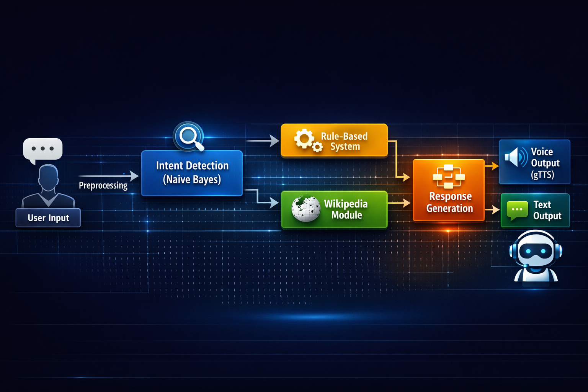

# CI-Buddy
## 🤖 CI Buddy — Computational Intelligence Chatbot
### 📖 Overview
CI Buddy is an interactive chatbot developed as part of a Computational Intelligence mini project.
It integrates machine learning, rule-based reasoning, and external knowledge sources to provide intelligent responses and an engaging user experience.
### 🎯 Objective
To design and implement a chatbot using Computational Intelligence techniques that can understand user queries, provide meaningful responses, and enhance learning through interaction and quiz-based evaluation.
### 🚀 Features

1. Intelligent chatbot with rule-based and ML-based responses  
2. Dynamic knowledge retrieval using Wikipedia  
3. Voice output support using gTTS  
4. Interactive quiz module with score tracking  
5. Chat history displayed in sidebar  
6. Clean and responsive dark-themed UI  

### 🧠 Techniques Used

**1. Naive Bayes Classification**  
Used for intent detection in the chatbot. It classifies user queries into categories such as definition, explanation, or quiz based on learned patterns from training data.

**2. Natural Language Preprocessing**  
User input is preprocessed by converting text to lowercase and removing punctuation. This ensures consistency and improves matching accuracy.

**3. Rule-Based Matching**  
The chatbot uses keyword-based matching to provide predefined responses for known Computational Intelligence topics, ensuring fast and reliable answers.

**4. External Knowledge Retrieval (Wikipedia API)**  
When a query is not found in the predefined knowledge base, the system fetches relevant information dynamically using the Wikipedia API.

**5. Text-to-Speech (gTTS)**  
The chatbot converts text responses into speech using Google Text-to-Speech, enabling audio interaction across devices including mobile.

**6. Session State Management**  
Streamlit session state is used to maintain chat history, quiz progress, and user interactions across the application.

**7. Interactive UI Design (Streamlit)**  
The user interface is built using Streamlit, enabling rapid development of a responsive and interactive web application.

### 🛠️ Technologies Used

**1. Python**  
The core programming language used for implementing the chatbot logic, machine learning model, and overall application flow.

**2. Streamlit**  
Used to build the interactive web-based user interface, including chatbot interaction, quiz module, and sidebar features.

**3. Scikit-learn**  
Provides machine learning support, specifically the Naive Bayes algorithm for intent classification of user queries.

**4. gTTS (Google Text-to-Speech)**  
Used to convert text responses into speech, enabling voice interaction across devices including mobile browsers.

**5. Wikipedia API**  
Used to fetch real-time information for queries that are not present in the predefined knowledge base.

**6. Regular Expressions (re module)**  
Used for text preprocessing and cleaning, such as removing emojis and improving voice output quality.

### 🧠 System Architecture  

The architecture of CI Buddy follows a hybrid approach combining machine learning, rule-based logic, and external knowledge retrieval.
<p align="center">
  
</p>

**Workflow Explanation:**

1. **User Input**  
   The user enters a query through the chatbot interface.

2. **Preprocessing**  
   The input is cleaned by converting to lowercase and removing punctuation.

3. **Intent Detection (Naive Bayes)**  
   A machine learning model classifies the user’s intent (e.g., definition, explanation, quiz).

4. **Processing Modules**  
   - **Rule-Based System** → Handles predefined CI-related queries  
   - **Wikipedia Module** → Fetches information dynamically for unknown queries  

5. **Response Generation**  
   The system generates an appropriate response based on the selected module.

6. **Output Layer**  
   - **Text Output** → Displayed in the chatbot interface  
   - **Voice Output (gTTS)** → Converts response into speech
### ⚙️ Installation & Setup  

1. **Clone the repository**
```bash
git clone https://github.com/your-username/ci-buddy.git
cd ci-buddy
2. **Install dependencies**
pip install -r requirements.txt
3.Run the application
streamlit run app.py

